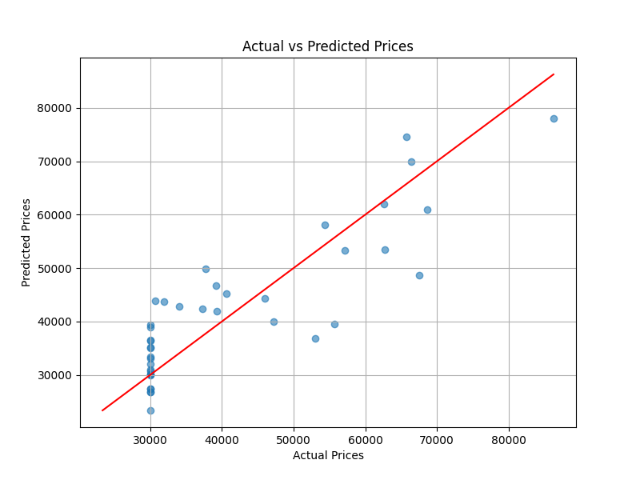

# 🏠 Housing Price Prediction with PyTorch

## 📌 Project Overview

This project builds a neural network using PyTorch to predict housing prices based on property features.

The model is trained on a dataset containing real estate attributes such as area, number of bedrooms, floor level, and distance to the city center.

---

## 🧠 Model Architecture

The neural network consists of:

- Input Layer: 5 features
- Hidden Layer: 64 neurons with ReLU activation
- Output Layer: 1 neuron (price prediction)

---

## ⚙️ Features Used

- `area_sqm`
- `bedrooms`
- `floor`
- `age_years`
- `distance_to_center_km`

---

## 🔄 Data Processing

- Feature scaling (standardization)
- Target scaling (important for stable training)
- Train/Test split (80/20)

---

## 📊 Model Performance

| Metric | Value |
|------|------|
| MAE  | ~6500 |
| R²   | ~0.73 |

---

## 📈 Visualization

The model predictions are compared against actual prices:

- Points close to the red line indicate accurate predictions.
- The diagonal line represents perfect predictions.

---

## 🧪 Experiment Tracking

Multiple experiments were conducted with different:

- Learning rates
- Hidden layer sizes
- Number of epochs

All results are stored in:
